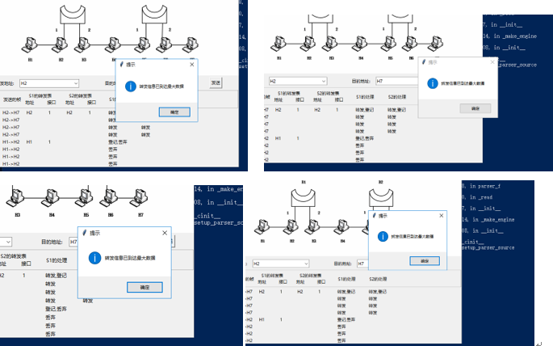
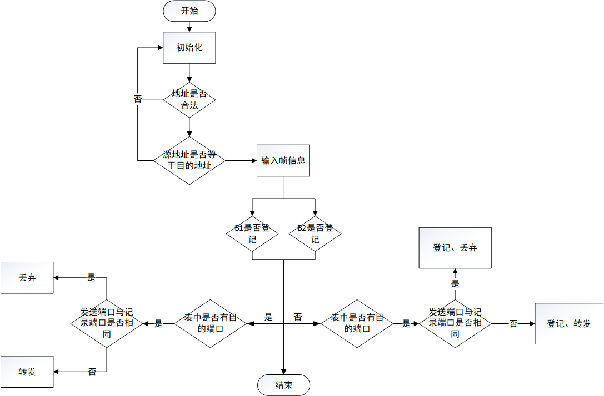

# Bridge-Forward-Simulator
网桥转发模拟工具
# 界面设计

# 设计环境
## 操作系统
Windows 10 教育版
## 运行环境
* Python 3.5.2
* Anaconda Jupyter Notebook
## Python模块
* Tkinter
* pandas
* PIL
* pyinstaller

## 核心算法

# 调试错误记录

2019年1月17日11：28分调试修复

1. 每次测试结果记录会进行保留，下一次结果保存会紧接前次结果后面。
2. 出发地址校验功能正常；目的地址校验功能暂未解决，如目的地址错误，网桥转发表能进行转发。

2019年1月21日15：30分调试修复

1. 第一次输入出发地址和目的地址，点击发送，无误，第二次未更改出发地址，只更改目的地址，转发表S1、S2无标记无显示。

2. 读取文件，重置后无法再次正常发送帧

3. 文件数大于转发表最大容量，读取到转发表展示时，会重复弹出提示窗口

